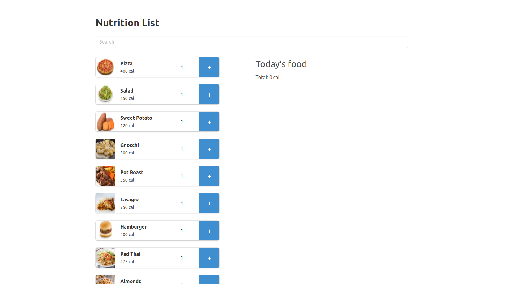
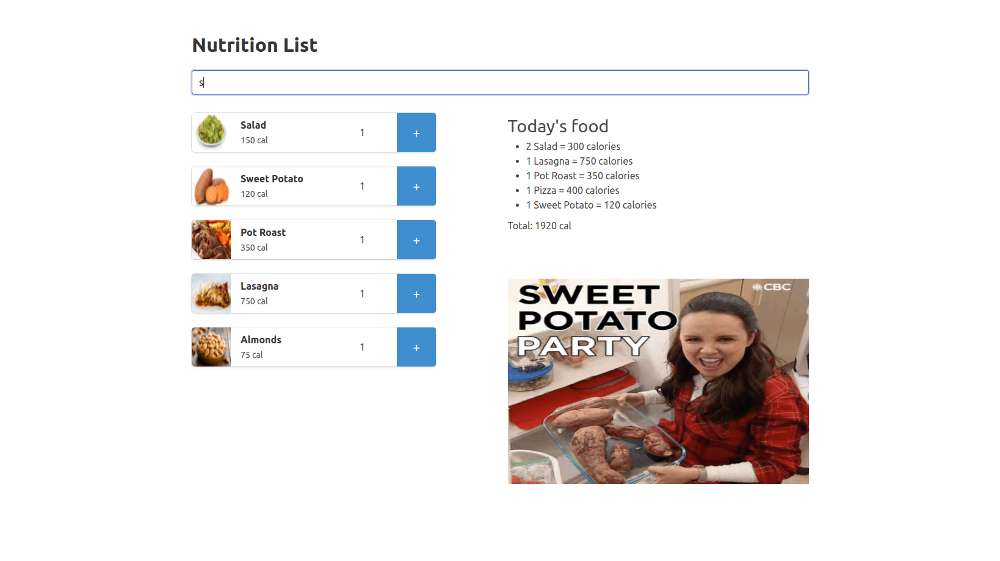

# Nutrition List
Nutrition List is a web app done for practicing React and API's integration. 
Add food to the list and check their calories with a fun touch!

You can try it [here](https://nutrition-list.onrender.com/)

## Setup
* Create a server .env file through the .env.sample file
* Server:

```
$ npm install
$ npm run dev
(It is executed on port 5000)
```

* Client:

```
$ npm install
$ npm start
(It is executed on port 3000)
```

## Screenshoots



## Technologies
* Node
* Express
* React
* Axios

## Features
* Show food list
* Create your own list
* Show food calories
* Show total calories

## APIs
* Own API REST

## Contact
This is a project performed by Abel Andrés
* Linkedin: https://www.linkedin.com/in/abel-andres
